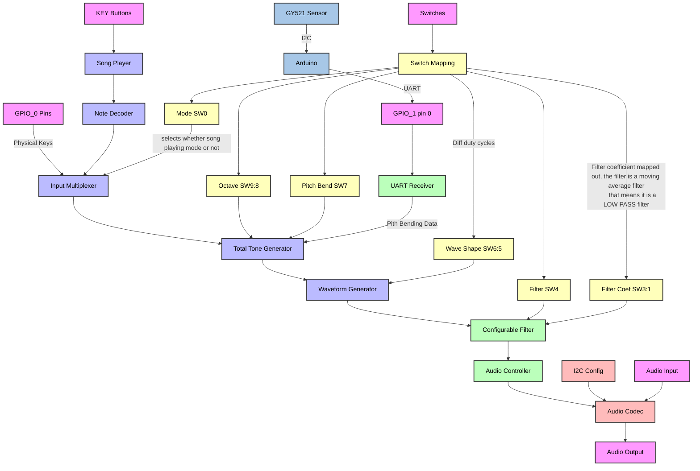

```mermaid
flowchart TB

 %% Style definitions
    classDef default fill:#fff,stroke:#333,stroke-width:2px,color:#000
    classDef decision fill:#fff,stroke:#333,stroke-width:2px,color:#000

%% Arduino and GY521
ARDUINO[Arduino]
GY521[GY521 Sensor]
%% Physical IO
GPIO0[GPIO_0 Pins]
GPIO1[GPIO_1 pin 0]
KEYS[KEY Buttons]
SWITCHES[Switches]
AUDIOIN[Audio Input]
AUDIOOUT[Audio Output]

    %% Switch Mapping
    SW_MAP[Switch Mapping]
    OCTAVE[Octave SW9:8]
    PITCH[Pitch Bend SW7]
    WAVE[Wave Shape SW6:5]
    FILTER_EN[Filter SW4]
    FILTER_COEF[Filter Coef SW3:1]
    MODE[Mode SW0]

    %% Main Components
    SONG[Song Player]
    NOTE_DEC[Note Decoder]
    MUX[Input Multiplexer]
    TONE_GEN[Total Tone Generator]
    WAVE_GEN[Waveform Generator]
    UART_RX[UART Receiver]
    FILTER[Configurable Filter]
    AUDIO_CTRL[Audio Controller]
    I2C[I2C Config]
    CODEC[Audio Codec]

    %% Comments Using Diamonds

    %% Connections
    GY521 -->|I2C| ARDUINO
    ARDUINO -->|UART| GPIO1

    GPIO0 --> |Physical Keys| MUX
    GPIO1 --> UART_RX
    KEYS --> SONG

    SWITCHES --> SW_MAP
    SW_MAP --> OCTAVE & PITCH & FILTER_EN & MODE
    SW_MAP -->|Diff duty cycles| WAVE
    SW_MAP -->|Filter coefficient mapped out, the filter is a moving average filter
        that means it is a LOW PASS filter|FILTER_COEF


    SONG --> NOTE_DEC --> MUX
    MODE --> |selects whether song playing mode or not| MUX
    MUX --> TONE_GEN

    OCTAVE --> TONE_GEN
    PITCH --> TONE_GEN
    UART_RX -->|Pith Bending Data| TONE_GEN

    TONE_GEN --> WAVE_GEN
    WAVE --> WAVE_GEN

    WAVE_GEN --> FILTER
    FILTER_EN --> FILTER
    FILTER_COEF --> FILTER

    FILTER --> AUDIO_CTRL
    AUDIO_CTRL --> CODEC
    I2C --> CODEC

    AUDIOIN --> CODEC
    CODEC --> AUDIOOUT

    %% Styling
    classDef io fill:#f9f,stroke:#333,stroke-width:2px
    classDef control fill:#ffb,stroke:#333,stroke-width:2px
    classDef sound fill:#bbf,stroke:#333,stroke-width:2px
    classDef process fill:#bfb,stroke:#333,stroke-width:2px
    classDef interface fill:#fbb,stroke:#333,stroke-width:2px
    classDef sensor fill:#A7C7E7,stroke:#333,stroke-wdith:2px

    class GPIO0,GPIO1,KEYS,SWITCHES,AUDIOIN,AUDIOOUT io
    class SW_MAP,OCTAVE,PITCH,WAVE,FILTER_EN,FILTER_COEF,MODE control
    class SONG,NOTE_DEC,MUX,TONE_GEN,WAVE_GEN sound
    class UART_RX,FILTER,AUDIO_CTRL process
    class I2C,CODEC interface
    class GY521,ARDUINO sensor
```
